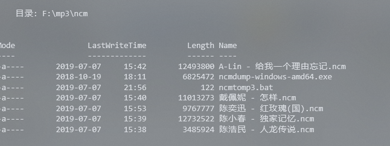
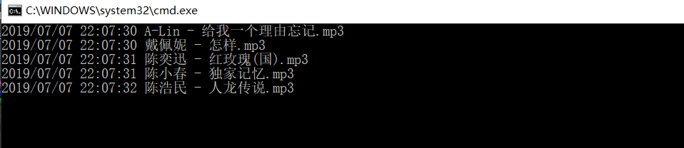
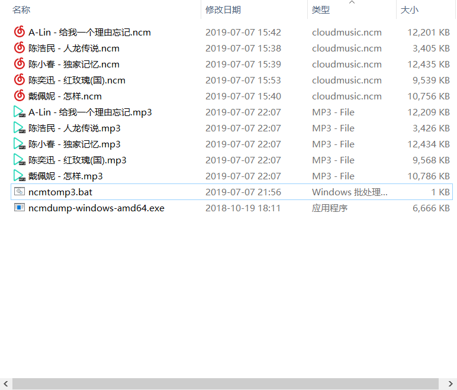

# ncmtomp3

### 【直接把ncm文件选中拖到这个exe也行，刚刚看到的，文件太多可以用bat】

1.下载ncmdump-windows-amd64.exe
	[下载链接1](https://github.com/yoki123/ncmdump/releases) | [下载链接2](./ncmdump-windows-amd64.exe)	

---
**链接1为软件作者，代码开源的！可以自己去，本人只是利用脚本批量操作而已**


2.在ncm文件目录创建bat文件,不会创建可以直接下载也行[下载链接](./ncmtomp3.bat)

```bash
@echo off&&setlocal enabledelayedexpansion

for %%i in (*.ncm) do (
call  ncmdump-windows-amd64.exe "%%i"
)
endlocal
```

**注意**：

​    以上两个文件是同ncm文件放在同一个目录，然后运行bat就行，bat的作用主要是利用命令批量转换，不用一个一个来搞






